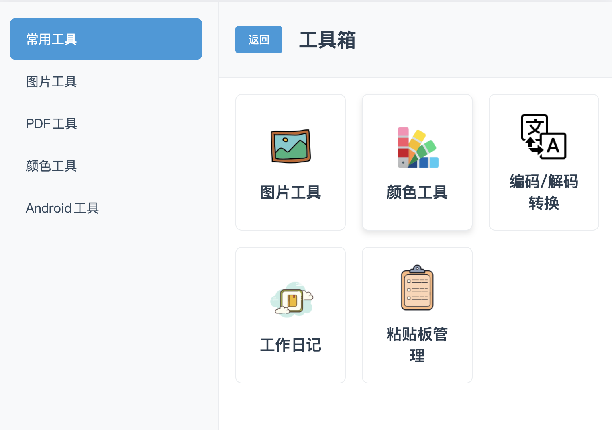
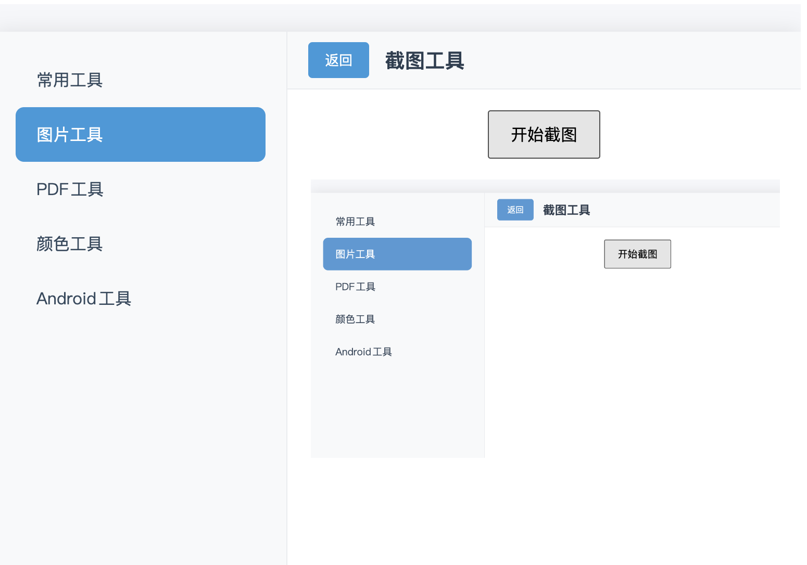
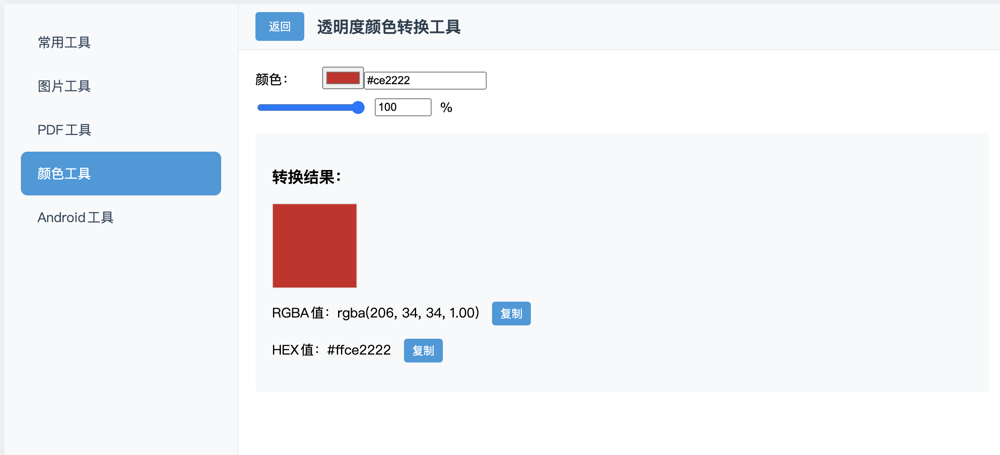
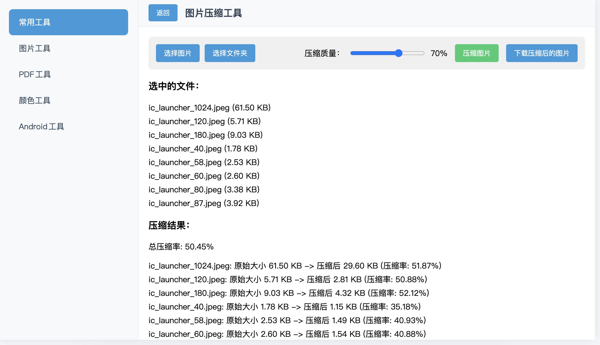

# DevBox Tools

DevBox Tools 是一个基于 Vue 3 的工具集合，旨在提供各种实用的开发工具和图像处理功能。

## 功能

- JavaScript 开发工具
- 图片工具
  - 图片压缩
  - PNG/JPEG 转 ICO
- PDF 工具（即将推出）
- 常用组件（即将推出）
- JavaScript 工具类（即将推出）

## 技术栈

- Vue 3
- Vue Router
- TypeScript
- Vite

## 预览

