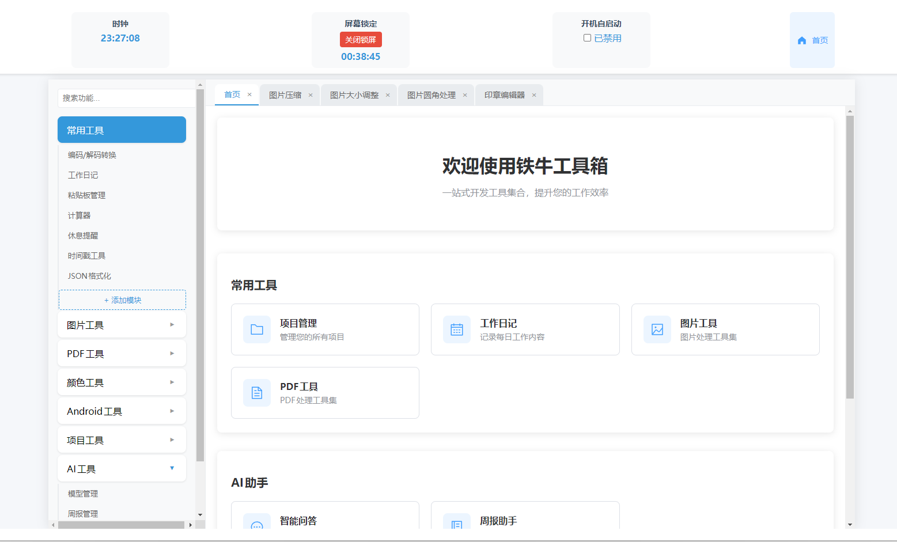
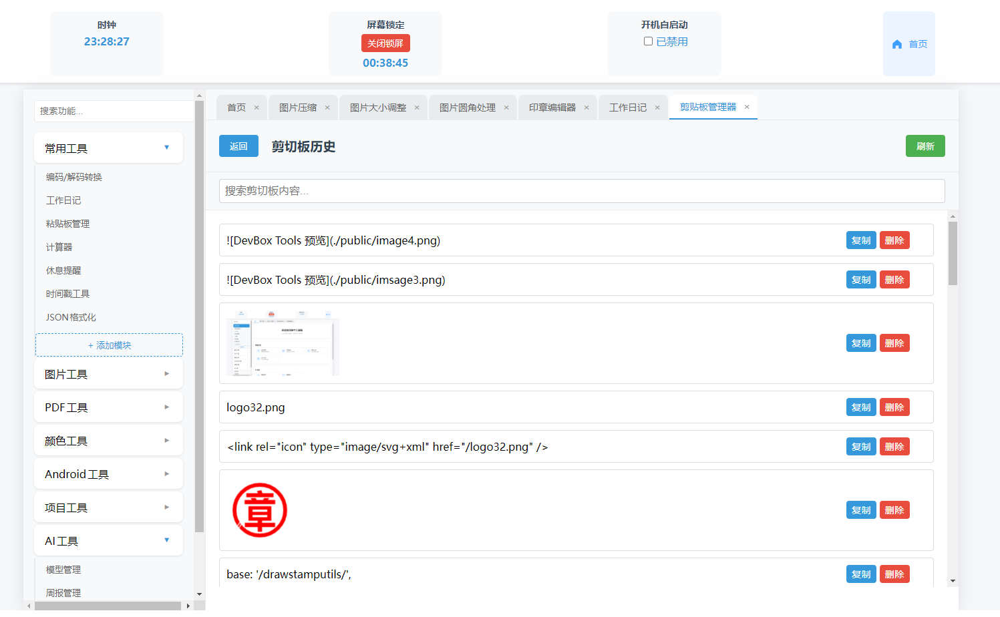
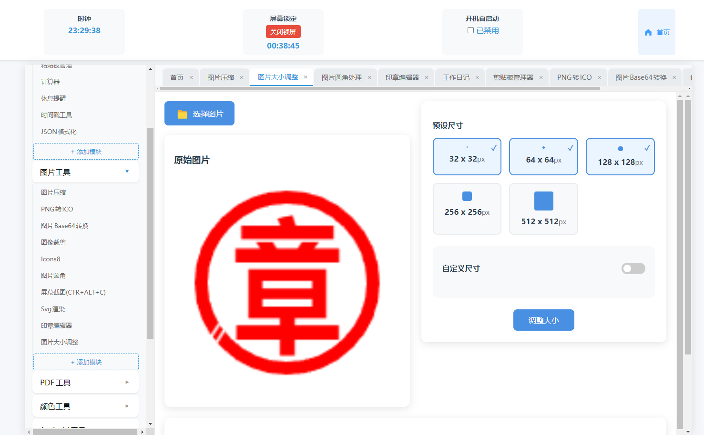

# DevBox Tools

DevBox Tools 是一个基于 Vue 3 的工具集合，旨在提供各种实用的开发工具和图像处理功能。

## 功能

- JavaScript 开发工具
- 图片工具
  - 图片压缩
  - PNG/JPEG 转 ICO
  - 图片大小批量调整
  - 图片圆角修改
  - 图片互转base64字符串
  - 屏幕截图，图片编辑
  - svg渲染，svg的渲染成图片
- 常用工具
  - 工作日记，记录每天工作内容防止忘记
  - 粘贴板管理，每次的粘贴板管理内容和图片
  - 休息提醒，间隔时间锁屏休息，防止痔疮
  - 时间戳工具，时间格式转换
  - JSON格式化，json数据的格式化
- 颜色工具
  - 颜色的rgb和hex16转换，提取颜色
- 项目工具（开发中）
- AI工具
  - ollama模型管理下载本地模型
  - 智能问答，与ollama的模型对话

## 技术栈

- Vue 3
- Vue Router
- TypeScript
- Vite

## 预览

